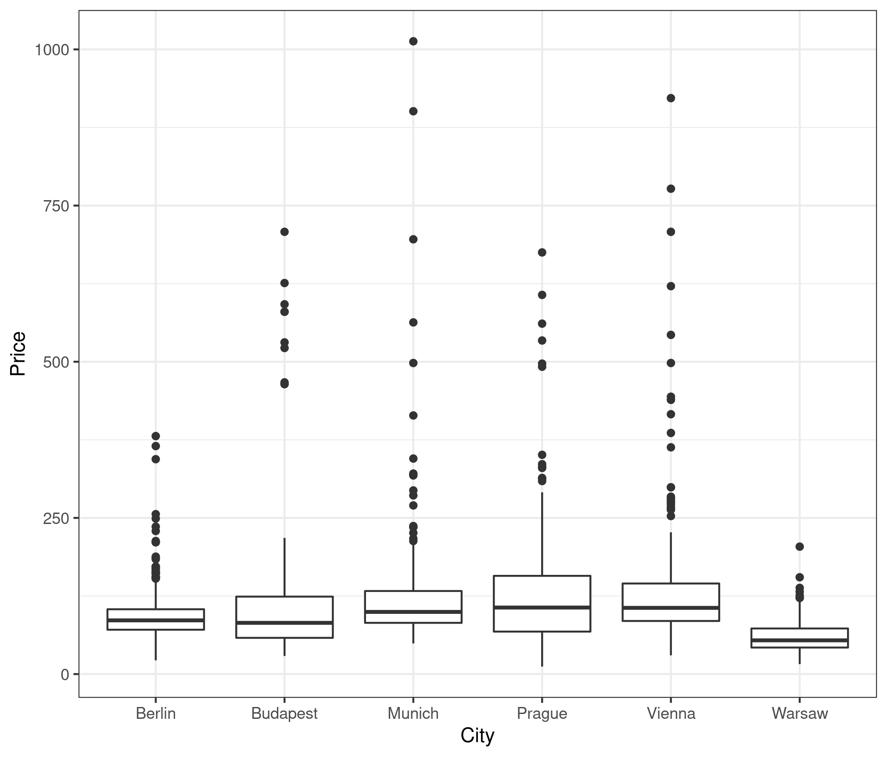
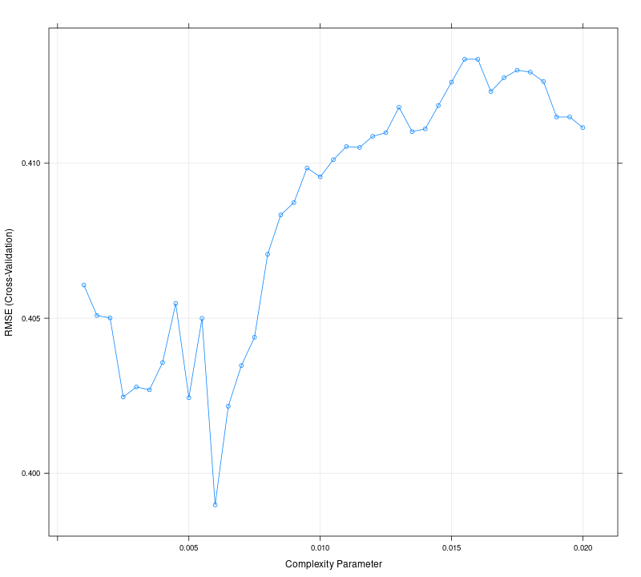

```{r setup, include=FALSE}
knitr::opts_chunk$set(echo = F)
```

# Introduction

In the current report, I am going to summarise my findings on how different moels perform in price pediction for european hotels. I have tried several different models to model the price of one night in a European hotel using the [`hotels-europe`](https://osf.io/r6uqb/) dataset. All code is available on [Github](https://github.com/szutsattila/da3-assignment3).

# Data preparation

I downloaded the data from osf and modified it only slightly to reduce the total sample size to a pre-specified sample.

-   I filtered out observations to only include offers from the Berlin, Munich, Vienna, Budapest, Prague, and Warsaw areas.
-   I filtered observations that were not Hotel, Hostel or Apart-hotel listings.
-   I filtered for offers that were in 2017 December on a weekday for one night.
-   I removed outliers in price, as I believe they were errors.
-   I added flags for missing values.
-   I transformed price to $log(\text{price})$.

# Exploratory Data Analysis

I investigated the relationship between price and my predictor variables and their distributions. First of all I checked the distribution of price, and as it had a long right tail, I decided to take the log of it, as explained earlier. Then I looked at the relationship between $log(\text{price})$ and my most important predictors such as ratings, number of ratings, stars, and distance. I found moderately high correlations, as you can see on the plot below, but there is no grounds for multi-collinearity. Note that I am going to use $log(\text{price})$ in all my models so RMSE can be compared across models, even though decision tree based models can handle non-linearities well.


# Modelling

I've built 5 different models on the same dataset. Firstly, however, I created a train and test split for my whole dataset so that I can evaluate the final model on an untouched sample. The five models were a multiple regression model, an elastic net model, a regression tree, a random forest model and a Gradient Boosting Machine. They were evaluated on the same 10-fold Cross Validation sample and the best models were selected based on the lowest cross-validated RMSE.

Based on these results GBM and Random Forest performs the best, and there is only a marginal difference between them. To see how they compare, I will evaluate all models on the test sample, however, it is important to note, that I am not going to change my evaluation on models performance based on the results of the test sample.

# Results


On this plot we can see the performance comparison visually for each model on the crossvalidation. We can clearly see that GBM and Random Forest perform better than all the other models, altough just a slightly bit. On the test sample we get the same results: GBM and RF outperform simple regression trees, multiple regression and elastic net models. This is in accordance with our expectations, and in this case, since the dataset was not too large and runtimes were relatively low, it would make sense to choose either GBM or Random Forest as it would not cost much more than a multiple regression model.

```{r include=FALSE}
library(tidyverse)
test_results <- read_csv("out/test_results.csv") %>% arrange(rmse)

```

```{r echo=FALSE, results="asis"}
knitr::kable(test_results) 
```

# Appendix

Here you can find more detailed plots on the dataset, and on the model parameters.

## Descriptive plots




## Model diagnostics




